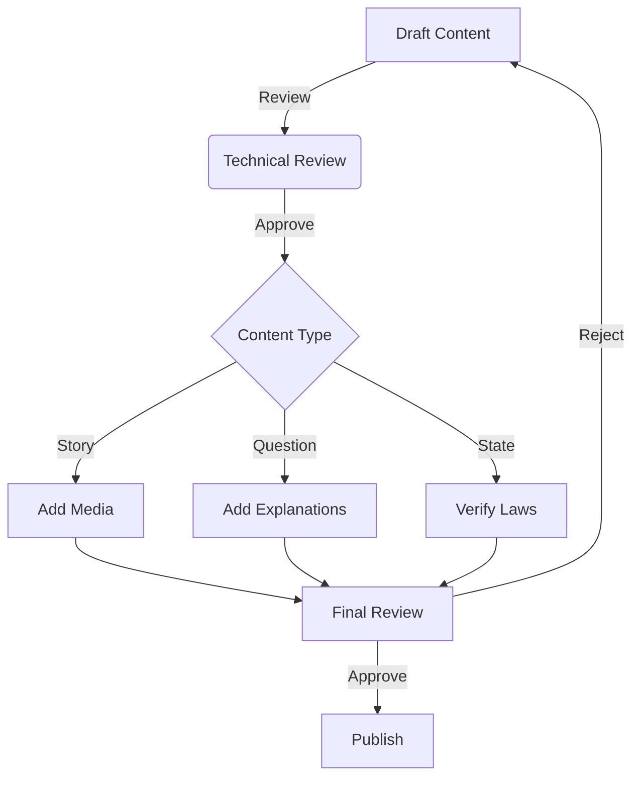

# Content Management Guide

## Overview

This guide details how to manage content in the Driver's Ed Stories platform using Payload CMS.

## Content Types

### 1. Stories

Stories are the main learning units in the platform.

#### Structure
```typescript
interface Story {
  title: string;
  slug: string;
  state: Reference<'states'>;
  content: {
    introduction: RichText;
    scenarios: Scenario[];
    summary: RichText;
    tips: string[];
  };
  metadata: {
    difficulty: 'beginner' | 'intermediate' | 'advanced';
    duration: number; // in minutes
    topics: string[];
    tags: string[];
  };
  requirements: {
    previousStories: Reference<'stories'>[];
    minimumLevel: number;
    completedTopics: string[];
  };
  media: {
    thumbnail: Media;
    images: Media[];
    videos: Media[];
  };
  quiz: {
    questions: Reference<'questions'>[];
    passingScore: number;
    timeLimit: number;
  };
  status: 'draft' | 'review' | 'published';
  publishedAt: Date;
}
```

#### Content Guidelines
1. **Writing Style**
   - Use active voice
   - Keep sentences concise
   - Include real-world examples
   - Use consistent terminology

2. **Scenario Structure**
   - Setup: Context and situation
   - Challenge: Decision point
   - Options: Multiple choices
   - Outcome: Consequences
   - Explanation: Learning points

3. **Media Requirements**
   - Images: 16:9 ratio, min 1200x675px
   - Videos: MP4 format, max 10 minutes
   - Audio: MP3 format, clear narration

### 2. Questions

Questions form the assessment part of stories and practice tests.

#### Structure
```typescript
interface Question {
  text: string;
  type: 'multiple-choice' | 'true-false' | 'scenario';
  options: {
    text: string;
    isCorrect: boolean;
    explanation: string;
  }[];
  metadata: {
    difficulty: 1 | 2 | 3 | 4 | 5;
    topics: string[];
    tags: string[];
    state: Reference<'states'>;
  };
  explanation: {
    correct: RichText;
    incorrect: RichText;
    additional: RichText;
  };
  media: {
    image?: Media;
    video?: Media;
  };
  statistics: {
    timesAnswered: number;
    correctPercentage: number;
    averageTime: number;
  };
}
```

#### Question Guidelines
1. **Writing Questions**
   - Clear and unambiguous
   - Single correct answer
   - Relevant to real situations
   - Progressive difficulty

2. **Answer Options**
   - 4 options for multiple choice
   - Plausible distractors
   - No obvious wrong answers
   - Clear correct answer

3. **Explanations**
   - Detailed reasoning
   - Reference to laws
   - Visual aids when helpful
   - Additional resources

### 3. State Content

State-specific content ensures relevance to local laws and conditions.

#### Structure
```typescript
interface State {
  name: string;
  code: string;
  content: {
    laws: LawSection[];
    requirements: Requirement[];
    specialRules: Rule[];
    localConditions: Condition[];
  };
  resources: {
    manual: {
      url: string;
      version: string;
      lastUpdated: Date;
    };
    additionalLinks: {
      title: string;
      url: string;
      description: string;
    }[];
  };
  testInfo: {
    format: string;
    passingScore: number;
    fee: number;
    validityPeriod: string;
  };
  statistics: {
    users: number;
    passRate: number;
    averageScore: number;
  };
}
```

### 4. Achievement System

Defines the gamification elements of the platform.

#### Structure
```typescript
interface Achievement {
  name: string;
  description: string;
  criteria: {
    type: 'story' | 'test' | 'streak' | 'time';
    requirement: number;
    conditions: string[];
  };
  rewards: {
    xp: number;
    badge: Media;
    perks: string[];
  };
  rarity: 'common' | 'rare' | 'epic' | 'legendary';
  displayOrder: number;
}
```

## Content Workflow

### 1. Content Creation Process



### 2. Quality Assurance

#### Content Checklist
```typescript
interface ContentChecklist {
  technical: {
    spelling: boolean;
    grammar: boolean;
    formatting: boolean;
    links: boolean;
  };
  educational: {
    accuracy: boolean;
    clarity: boolean;
    relevance: boolean;
    difficulty: boolean;
  };
  media: {
    quality: boolean;
    accessibility: boolean;
    optimization: boolean;
    rights: boolean;
  };
  legal: {
    accuracy: boolean;
    currentness: boolean;
    compliance: boolean;
    disclaimers: boolean;
  };
}
```

### 3. Content Update Process

#### Update Types
1. **Regular Updates**
   - Weekly content additions
   - Monthly law updates
   - Quarterly content review

2. **Emergency Updates**
   - Law changes
   - Error corrections
   - Critical updates

#### Version Control
```typescript
interface ContentVersion {
  version: string;
  changes: {
    type: 'add' | 'modify' | 'remove';
    description: string;
    reason: string;
    editor: string;
  }[];
  reviewedBy: string;
  approvedBy: string;
  publishedAt: Date;
}
```

## Best Practices

### 1. Content Creation
- Research thoroughly
- Use official sources
- Include practical examples
- Progressive difficulty
- Regular updates

### 2. Media Management
- Optimize all media
- Use consistent styling
- Include alt text
- Maintain aspect ratios
- Version control

### 3. Quality Control
- Peer review all content
- Regular audits
- User feedback
- Performance metrics
- Accessibility checks

## Analytics and Reporting

### 1. Content Performance
```typescript
interface ContentAnalytics {
  engagement: {
    views: number;
    completions: number;
    averageTime: number;
    dropoffPoints: number[];
  };
  effectiveness: {
    testScores: number;
    retentionRate: number;
    userFeedback: Feedback[];
  };
  technical: {
    loadTime: number;
    errorRate: number;
    mediaPlayback: number;
  };
}
```

### 2. User Behavior
```typescript
interface UserAnalytics {
  learning: {
    preferredTimes: TimeDistribution;
    contentPreferences: ContentType[];
    completionRates: Rate[];
  };
  progression: {
    speedOfAdvancement: number;
    strugglingAreas: Topic[];
    successfulTopics: Topic[];
  };
}
```

## Troubleshooting

### Common Issues

1. **Content Not Displaying**
   - Check publishing status
   - Verify media URLs
   - Clear cache
   - Check permissions

2. **Media Problems**
   - Verify file formats
   - Check size limits
   - Confirm CDN status
   - Review optimization

3. **Version Conflicts**
   - Check content locks
   - Review version history
   - Merge changes carefully
   - Backup before updates
