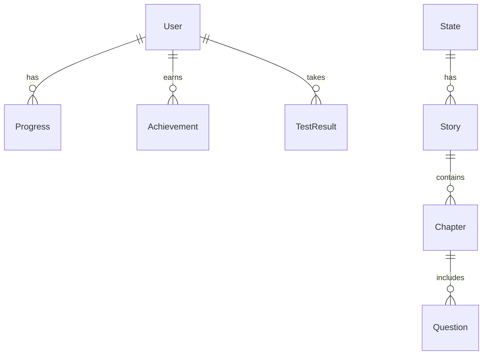
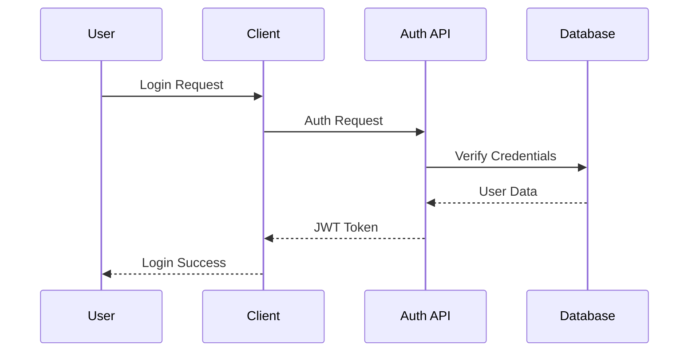

# Technical Architecture Guide

## System Architecture

### 1. Frontend Architecture

#### Component Structure
```
components/
├── ui/               # Base UI components
│   ├── button
│   ├── card
│   ├── dialog
│   └── forms
├── features/         # Feature-specific components
│   ├── stories
│   ├── practice
│   └── profile
├── layouts/          # Layout components
└── shared/          # Shared components

app/
├── (auth)/          # Authentication routes
├── (dashboard)/     # User dashboard
├── (stories)/       # Story content
├── (practice)/      # Practice tests
└── (admin)/         # Admin panel
```

#### State Management
```typescript
// User Store
interface UserStore {
  user: User | null;
  progress: Progress;
  achievements: Achievement[];
  setUser: (user: User) => void;
  updateProgress: (progress: Progress) => void;
  addAchievement: (achievement: Achievement) => void;
}

// Learning Store
interface LearningStore {
  currentStory: Story | null;
  progress: number;
  checkpoints: Checkpoint[];
  setStory: (story: Story) => void;
  updateProgress: (progress: number) => void;
  completeCheckpoint: (checkpoint: Checkpoint) => void;
}
```

#### Performance Optimizations
- Image optimization with next/image
- Dynamic imports for large components
- Route prefetching
- Incremental Static Regeneration
- Edge caching

### 2. Backend Architecture

#### API Routes Structure
```
app/api/
├── auth/           # Authentication endpoints
│   ├── [...nextauth]
│   └── callback
├── stories/        # Story management
│   ├── [id]
│   └── progress
├── practice/       # Practice test endpoints
├── users/          # User management
└── webhooks/       # External service webhooks
```

#### Database Schema Relationships


#### Caching Strategy
```typescript
interface CacheConfig {
  stories: {
    ttl: 3600, // 1 hour
    staleWhileRevalidate: true
  },
  stateContent: {
    ttl: 86400, // 24 hours
    staleWhileRevalidate: true
  },
  userProgress: {
    ttl: 300, // 5 minutes
    staleWhileRevalidate: false
  }
}
```

### 3. Content Management System

#### Collection Structure
```typescript
// Story Collection
interface StoryCollection {
  title: string;
  slug: string;
  state: Reference<'states'>;
  content: RichText;
  checkpoints: Checkpoint[];
  difficulty: 'beginner' | 'intermediate' | 'advanced';
  requirements: string[];
  media: Media[];
  publishedAt: Date;
}

// Question Collection
interface QuestionCollection {
  text: string;
  type: 'multiple-choice' | 'true-false';
  options: string[];
  correctAnswer: string;
  explanation: RichText;
  difficulty: number;
  tags: string[];
  state: Reference<'states'>;
}
```

#### Media Handling
```typescript
interface MediaConfig {
  upload: {
    staticDir: 'media',
    staticURL: '/media',
    imageSizes: [
      { name: 'thumbnail', width: 400, height: 300 },
      { name: 'card', width: 800, height: 600 },
      { name: 'full', width: 1920, height: 1080 }
    ],
    mimeTypes: ['image/jpeg', 'image/png', 'video/mp4']
  }
}
```

### 4. Security Implementation

#### Authentication Flow


#### Rate Limiting Configuration
```typescript
interface RateLimitConfig {
  public: {
    windowMs: 15 * 60 * 1000, // 15 minutes
    max: 100 // limit each IP to 100 requests per windowMs
  },
  authenticated: {
    windowMs: 15 * 60 * 1000,
    max: 300
  },
  signup: {
    windowMs: 60 * 60 * 1000, // 1 hour
    max: 5
  }
}
```

### 5. Testing Strategy

#### Test Structure
```
__tests__/
├── unit/
│   ├── components/
│   ├── hooks/
│   └── utils/
├── integration/
│   ├── api/
│   └── features/
└── e2e/
    ├── auth.spec.ts
    ├── learning.spec.ts
    └── practice.spec.ts
```

#### Testing Utilities
```typescript
interface TestUtils {
  renderWithProviders: (ui: React.ReactElement) => RenderResult;
  createMockUser: () => User;
  createMockStory: () => Story;
  mockProgress: () => Progress;
}
```

### 6. Monitoring and Analytics

#### Performance Metrics
```typescript
interface PerformanceMetrics {
  pageLoad: {
    ttfb: number;
    fcp: number;
    lcp: number;
    cls: number;
  };
  api: {
    responseTime: number;
    errorRate: number;
    successRate: number;
  };
  user: {
    sessionDuration: number;
    pagesPerSession: number;
    bounceRate: number;
  }
}
```

#### Error Tracking
```typescript
interface ErrorConfig {
  sentry: {
    dsn: string;
    tracesSampleRate: 1.0,
    replaysSessionSampleRate: 0.1,
    replaysOnErrorSampleRate: 1.0,
  }
}
```

### 7. Deployment Configuration

#### CI/CD Pipeline
```yaml
stages:
  - test
  - build
  - deploy

test:
  script:
    - npm install
    - npm run test
    - npm run lint

build:
  script:
    - npm run build
    - docker build -t driversed .

deploy:
  script:
    - vercel deploy --prod
```

#### Infrastructure
```typescript
interface InfrastructureConfig {
  vercel: {
    regions: ['iad1', 'sfo1', 'dub1'],
    framework: 'nextjs',
    buildCommand: 'npm run build',
  },
  database: {
    postgres: {
      provider: 'supabase',
      region: 'us-east-1',
    },
    mongodb: {
      provider: 'atlas',
      tier: 'M0',
    }
  }
}
```

## Advanced Features

### 1. Adaptive Learning System
```typescript
interface AdaptiveLearning {
  userPerformance: {
    accuracy: number;
    speed: number;
    consistency: number;
  };
  contentDifficulty: {
    current: number;
    adjustment: number;
  };
  recommendations: {
    nextContent: Content[];
    reviewTopics: Topic[];
  }
}
```

### 2. Real-time Progress Tracking
```typescript
interface ProgressTracking {
  metrics: {
    completion: number;
    accuracy: number;
    timeSpent: number;
  };
  achievements: {
    earned: Achievement[];
    progress: AchievementProgress[];
  };
  insights: {
    strengths: Topic[];
    weaknesses: Topic[];
    recommendations: string[];
  }
}
```

### 3. Content Personalization
```typescript
interface PersonalizationEngine {
  userProfile: {
    learningStyle: 'visual' | 'auditory' | 'reading' | 'kinesthetic';
    pace: 'slow' | 'medium' | 'fast';
    preferences: string[];
  };
  contentAdaptation: {
    format: ContentFormat;
    difficulty: number;
    examples: Example[];
  }
}
```

## Integration Points

### 1. Third-party Services
```typescript
interface ServiceIntegrations {
  stripe: {
    webhooks: WebhookHandler[];
    products: Product[];
    prices: Price[];
  };
  aws: {
    s3: S3Config;
    cloudfront: CloudFrontConfig;
  };
  sentry: {
    errorTracking: ErrorConfig;
    performance: PerformanceConfig;
  }
}
```

### 2. External APIs
```typescript
interface ExternalAPIs {
  dmv: {
    endpoints: string[];
    methods: string[];
    authentication: AuthConfig;
  };
  maps: {
    provider: 'google' | 'mapbox';
    apiKey: string;
    features: string[];
  }
}
```

## Performance Optimization

### 1. Caching Strategy
```typescript
interface CachingStrategy {
  cdn: {
    provider: 'cloudflare' | 'cloudfront';
    ttl: number;
    rules: CacheRule[];
  };
  api: {
    redis: RedisConfig;
    strategies: CacheStrategy[];
  };
  static: {
    compression: boolean;
    headers: Header[];
  }
}
```

### 2. Database Optimization
```typescript
interface DatabaseOptimization {
  indexes: Index[];
  sharding: ShardConfig;
  replication: ReplicationConfig;
  queryOptimization: {
    explain: boolean;
    logging: boolean;
    slow_query_log: boolean;
  }
}
```
